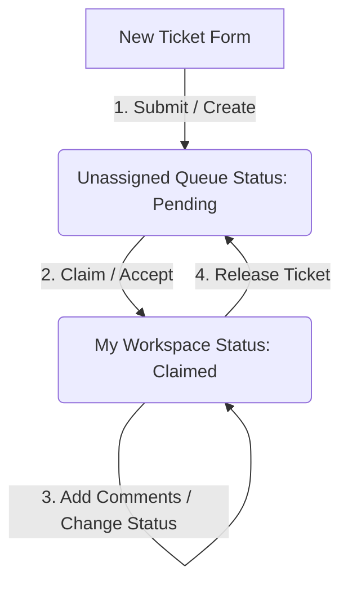
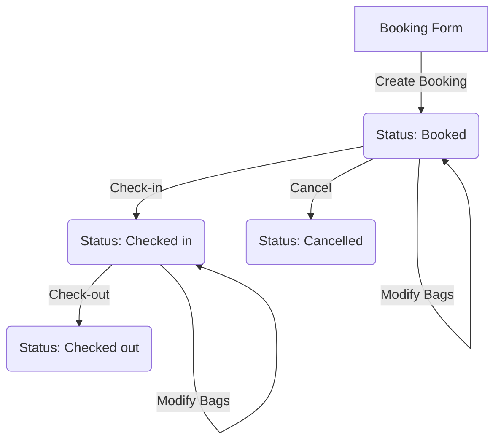

# Booking & Support Ticket Portal - Documentation

A unified frontend dashboard for managing **luggage storage bookings** and **customer support tickets**. This documentation describes the application structure, data schemas, and state management processes to support backend integration.

---

## 📂 Project Structure & File Directory Labels

The following layout describes the purpose and responsibility of each directory and file in the project.

### Root Files

* `index.html` — The main entry HTML template for the Single Page Application.
* `package.json` — Lists the project dependencies, scripts, and build configurations.
* `tailwind.config.js` — Tailwind CSS configuration defining theme extensions, color palettes, and utilities.
* `vite.config.js` — Configuration file for Vite, including path alias routing (`@` pointing to `src`).

### `src/` Directory

The core frontend codebase containing the application logic, styles, and assets.

* 🌐 [main.js](file:///Users/sethoa/Support%20ticket%20portal/src/main.js) — The application entry point. Initializes the Vue application, Pinia state stores, and the Vue Router.
* 📦 [App.vue](file:///Users/sethoa/Support%20ticket%20portal/src/App.vue) — The root Vue component. Manages the high-level layout wrapper and centralizes the luggage bookings state syncing.

#### 📂 `src/router/`

* [index.js](file:///Users/sethoa/Support%20ticket%20portal/src/router/index.js) — Defines Vue Router paths and view mappings:
  * `/` redirects to `/unassigned` (Unassigned Tickets)
  * `/unassigned` -> `UnassignedTicketsPage.vue`
  * `/my-tickets` -> `MyWorkspacePage.vue`
  * `/booked-tickets` -> `BookedTicketsPage.vue`
  * `/analytics` -> `DashboardAnalyticsPage.vue`
  * Catch-all fallback (`/:catchAll(.*)`) redirects to `/unassigned`

#### 📂 `src/stores/` (State Management)

* [Data.js](file:///Users/sethoa/Support%20ticket%20portal/src/stores/Data.js) — Serves as the mock data seed file. Declares the initial sample states for tickets and bookings, and defines helpers to retrieve/save items to `localStorage`.
* [ticketStore.js](file:///Users/sethoa/Support%20ticket%20portal/src/stores/ticketStore.js) — Pinia store managing the tickets state, handle actions such as ticket creation, claiming (assigning to agent), releasing, and comment updates.
* [themeStore.js](file:///Users/sethoa/Support%20ticket%20portal/src/stores/themeStore.js) — Pinia store handling light/dark theme preference and updates the document body class lists.
* [uiStore.js](file:///Users/sethoa/Support%20ticket%20portal/src/stores/uiStore.js) — Pinia store tracking UI layout states (e.g. sidebar toggle status).

#### 📂 `src/views/` (Page View Components)

* [UnassignedTicketsPage.vue](file:///Users/sethoa/Support%20ticket%20portal/src/views/UnassignedTicketsPage.vue) — Renders the queue of incoming support requests that have not been claimed by any agent.
* [MyWorkspacePage.vue](file:///Users/sethoa/Support%20ticket%20portal/src/views/MyWorkspacePage.vue) — Shows the list of tickets claimed by the active support agent, allowing the user to view detail screens, write notes/comments, or release the ticket.
* [BookedTicketsPage.vue](file:///Users/sethoa/Support%20ticket%20portal/src/views/BookedTicketsPage.vue) — Contains the luggage manifest interface, listing active, checked-in, checked-out, and cancelled customer baggage bookings.
* [DashboardAnalyticsPage.vue](file:///Users/sethoa/Support%20ticket%20portal/src/views/DashboardAnalyticsPage.vue) — Placeholder for analytics visualizations and operational metrics.

#### 📂 `src/components/` (Reusable Vue UI Components)

* **`Layout/`**
  * `AppNavbar.vue` — Renders the global top navigation bar containing theme toggle, user profile info, and layout settings.
  * `Sidebar.vue` — Renders the main sidebar with links to the different pages.
  * `MainLayout.vue` — Groups the Sidebar and AppNavbar together, structuring the overall page container.
* **`UnassignedTickets/`**
  * `NewTicketForm.vue` — Form modal for submitting a new support request.
  * `TicketsBoard.vue` — Grid showing cards of unassigned tickets with options to view details or claim them.
  * `SortControls.vue` — Search and filter bar for sorting tickets by priority, date, or company name.
* **`MyTickets/`**
  * `Workspaceheader.vue` — Renders statistics and counters for the agent's claimed tickets.
  * `Ticketsgrid.vue` — Grid of tickets claimed by the current agent.
  * `Ticketdetailview.vue` — Detailed panel for viewing a claimed ticket, writing comments, and updating ticket status.
  * `Commentfeed.vue` — Renders the history of comments/notes left on a ticket.
  * `Resolutionpanel.vue` — Panel containing status toggles and actions for ticket resolution.
* **`BookedTickets/`**
  * `BookingsHeader.vue` — Statistics for luggage manifests (bag counts, active deposits).
  * `BookingFilters.vue` — Filter tabs (All, Booked, Checked In, Checked Out, Cancelled) and search.
  * `BookingsTable.vue` — Table listing the luggage bookings.
  * `BookingDetail.vue` — Side panel showing customer contact details, checked bag items, and baggage status.
  * `BookingForm.vue` — Form for registering a new baggage deposit.
* **`Shared/`**
  * `Modal.vue` — A reusable overlay modal dialog.

---

## 📊 Data Models & Schemas

### 1. Ticket Schema

Represents a customer support request or ticket.

| Field Name | Type | Description |
| :--- | :--- | :--- |
| `id` | `String` | Unique identifier (prefixed with `APL-`, e.g., `APL-0001`). Generated using timestamp chunking. |
| `company` | `String` | Name of the customer's organization. |
| `category` | `String` | Type of service (e.g., `'Creative Design Agency'`, `'IT Department'`). |
| `position` | `String` | Subject title or role related to the ticket. |
| `type` | `String` | Nature of agreement (e.g., `'FULLTIME'`, `'PART TIME'`, `'FREELANCE'`). |
| `status` | `String` | Current status of the ticket (e.g., `'Pending'`, `'On-Hold'`, `'Candidate'`). |
| `appliedDate` | `String` | Date and time the ticket was opened. Format: `Month Day, Year, Hour:Minute AM/PM`. |
| `email` | `String` | Customer email address. |
| `phone` | `String` | Customer phone number. |
| `priority` | `String` | Severity level of the issue: `'low'`, `'medium'`, `'high'`, `'critical'`. |
| `department` | `String` | Internal department assigned to handle the ticket. |
| `description` | `String` | Detailed explanation of the support request. |
| `acceptedBy` | `String` \| `null` | The email address of the support agent who claimed this ticket. If `null`, it is unassigned. |
| `comments` | `Array<Comment>`| Chronological list of notes appended to the ticket. Defaults to `[]`. |

### 2. Comment Schema

Represents an individual comment added to a support ticket.

| Field Name | Type | Description |
| :--- | :--- | :--- |
| `id` | `String` | Unique comment identifier. |
| `author` | `String` | Display name of the agent who wrote the comment. |
| `text` | `String` | Body text of the comment. |
| `date` | `String` | Timestamp showing when the comment was created. |

### 3. Luggage Booking Schema

Represents a baggage storage booking.

| Field Name | Type | Description |
| :--- | :--- | :--- |
| `id` | `String` | Unique booking identifier (e.g., `BOX-302`, `LAX-211`). |
| `customerName`| `String` | Full name of the customer depositing luggage. |
| `storeCode` | `String` | Facility location code (e.g., `BOX-302`). |
| `checkInDate` | `String` | Expected date of check-in. |
| `checkOutDate`| `String` | Expected date of check-out. |
| `timeString` | `String` | Customer's drop-off and pick-up time slot. |
| `hoursString` | `String` | Total duration of baggage storage. |
| `bagsCount` | `Number` | Number of bags deposited. |
| `earnings` | `Number` | Revenue generated by the booking. Calculated as: `bagsCount * 5` ($5 per bag). |
| `status` | `String` | Current state of the booking: `'Booked'`, `'Active'`, `'Checked in'`, `'Checked out'`, `'Cancelled'`. |
| `email` | `String` | Customer's contact email. |
| `phone` | `String` | Customer's contact phone number. |
| `notes` | `String` | Specific bag descriptions, fragility alerts, or storage preferences. |

---

## 🔄 Core Processes & State Operations

This section details how data mutations and state flows are triggered.

### 1. Support Ticket Lifecycle

* **Ticket Creation**:
  * Action: `createTicket(payload)` in `ticketStore.js`.
  * Generates a new ID (`APL-` + last 6 digits of timestamp) and records details.
  * Prepends the ticket to the global list and updates local persistence.
* **Assignment / Claiming**:
  * Action: `acceptTicket(id, email)` in `ticketStore.js`.
  * Associates the ticket with the logged-in agent by setting `acceptedBy = 'ansahaudi86@gmail.com'`.
  * This action moves the ticket from the **Unassigned Queue** view to the agent's **My Workspace** view.
* **Releasing**:
  * Action: `releaseTicket(id)` in `ticketStore.js`.
  * Resets `acceptedBy = null`.
  * Moves the ticket back into the public **Unassigned Queue** so other agents can claim it.
* **Editing & Resolving**:
  * Action: `updateTicket(updatedTicket)` in `ticketStore.js`.
  * Updates properties like `status` or appends new `Comment` items to the comments array.

### 2. Luggage Booking Lifecycle

* **Baggage Registration**:
  * Action: `handleCreateBooking(newBooking)` in `App.vue`.
  * Registers a new customer luggage manifest in the list.
* **Baggage Count Modification**:
  * Action: `handleAddBag(bookingId)` / `handleRemoveBag(bookingId)` in `BookedTicketsPage.vue`.
  * Increases or decreases `bagsCount`.
  * **Business Logic Rule**: Recalculates revenue dynamically where `earnings = bagsCount * 5`.
* **State Updates**:
  * Action: `handleUpdateStatus({ bookingId, status })` or `handleCancelBooking(bookingId)`.
  * Modifies the booking's `status` tag. Available statuses include `'Booked'`, `'Active'`, `'Checked in'`, `'Checked out'`, and `'Cancelled'`.

### 3. UI Context & Customization

* **Theme Toggle**:
  * Action: `toggleTheme()` in `themeStore.js`.
  * Flips the active class on `document.documentElement` (`.dark` class) and caches preference in local storage.
* **Sidebar Toggle**:
  * Action: `toggleSidebar()` in `uiStore.js`.
  * Tracks collapsed/expanded status of the left-hand navigation panel.

---

## 🚀 How to Run

1. Install project dependencies:
   npm install

2. Start the local development server:

   npm run dev